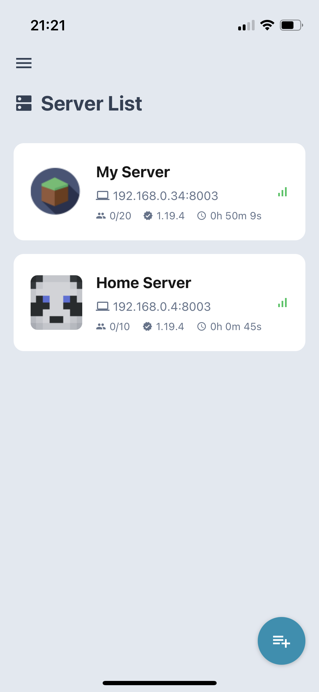
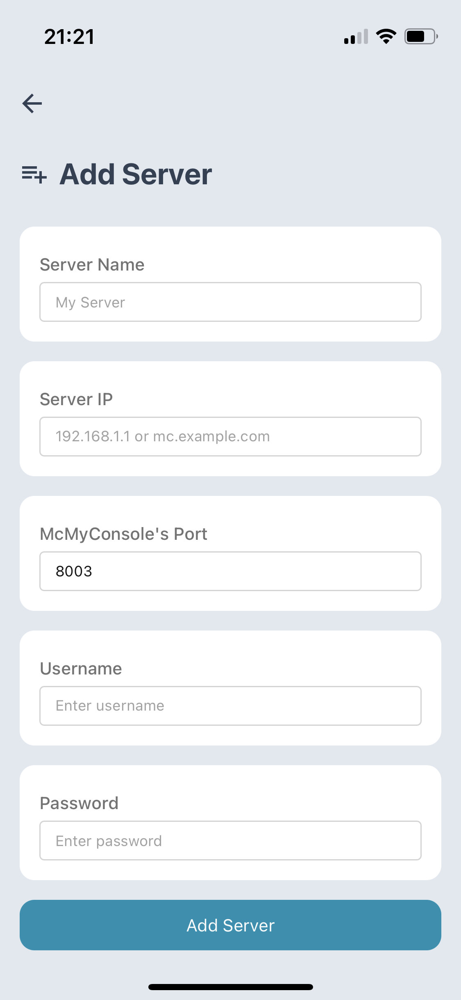
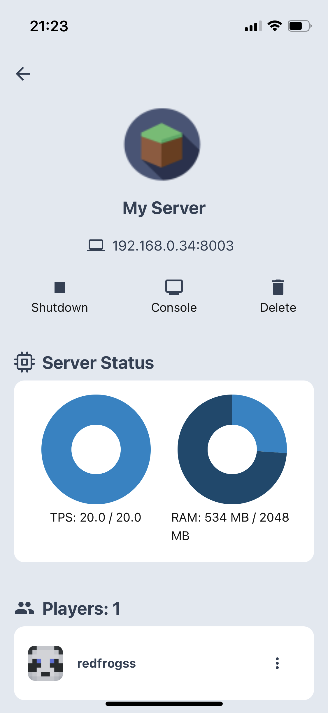
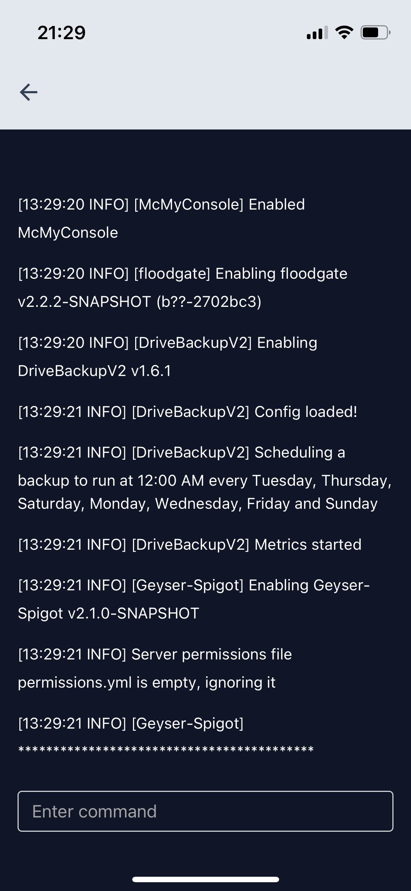

# 🛠️ McMyConsole - Minecraft Server Manager

**McMyConsole** is a mobile app that allows you to monitor and manage your Minecraft server from your phone. 

\* This app is still in development.

<!-- Thumbnails -->

<!-- App Store Links -->

## ✨ Features
This app aims to monitor and manage several small-scale Minecraft server from your phone. 

Key features:
- [x] Manage multiple servers
- [x] Server status (Players, TPS, RAM, etc.)
- [x] Server console
- [ ] etc.

## 💭 How it works
This app uses the McMyConsole Plugin API to communicate with the server. Then, the plugin uses the Bukkit API to manage the server.

## 📱 Screenshots
<!-- Screenshots -->

<table style="height: 120px">
  <tr>
    <td>
      
    </td>
    <td>
      
    </td>
  </tr>
    <tr>
    <td>
      
    </td>
    <td>
      
    </td>
  </tr>
</table>
  
## Learn More
This project uses the following technologies:
- [Expo](https://expo.dev/)
- [Expo Router](https://expo.github.io/router/docs)
- [NativeBase](https://nativebase.io/)
- [async-storage](https://www.npmjs.com/package/@react-native-async-storage/async-storage)
- [Minotar Minecraft Avatar API](https://minotar.net/)
- [KingPNG's Minecraft Icon PNG](https://www.kindpng.com/imgv/iRTJwow_minecraft-icon-png-flat-minecraft-icon-transparent-png/)
